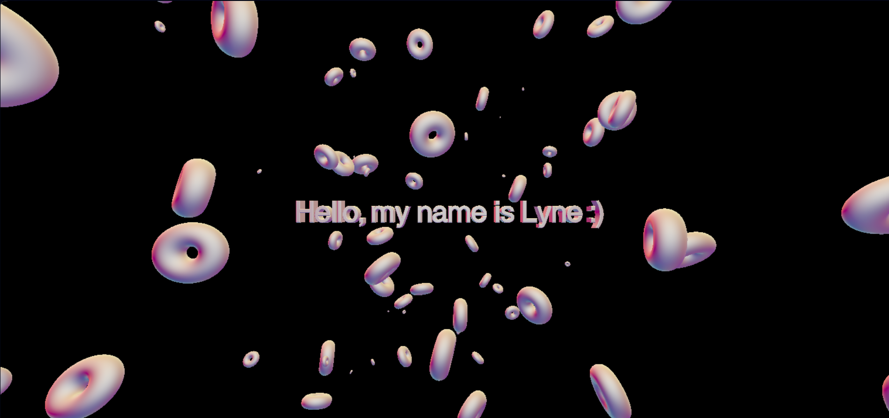

# This is my exercice of the threeJS workshop that [@HappyFeys](https://github.com/HappyFeys) conducted during out training at Becode 
what we learned : 

- [Présentation](./creationInstallation.md)
- [Installation](./creationInstallation.md)
- [Les bases](./base.md)
    - Scène
    - Objet simple
    - Render
    - Animation
    - A vous de jouer
- [Création d’un texte 3D](./text3D.md)
- [Jouons un peu](./lefun.md)
    - Ajouter des formes
    - Utiliser d’autres material
    - Ajouter de la lumière
    - etc

 ## finished product

- [original repository](https://github.com/HappyFeys/workshop-threeJs)
- [Dylan, author and conductor of the workshop](https://github.com/HappyFeys)
