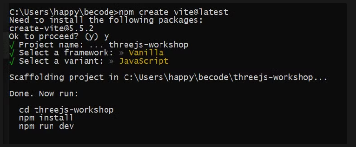
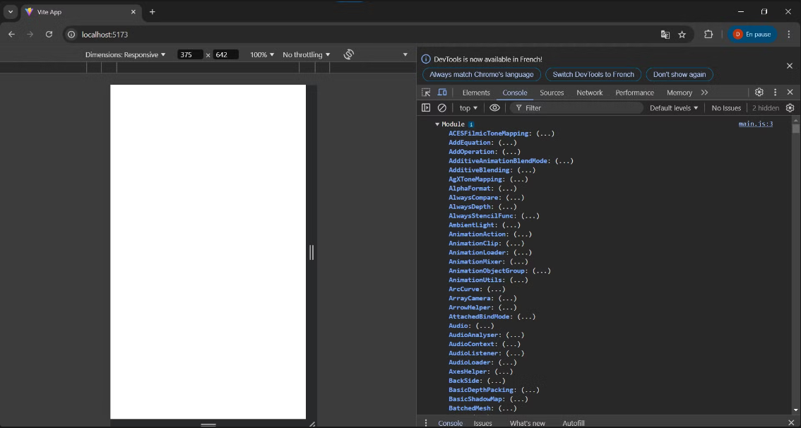

## Présentation

Three.js est une bibliothèque JavaScript 3D qui permet aux développeurs de créer des expériences 3D pour le web. Elle fonctionne avec WebGL, mais vous pouvez également la faire fonctionner avec SVG et CSS. Ces deux derniers sont assez limités, et nous ne les couvrirons pas dans ce cours.

### Qu’est-ce que WebGL ?

WebGL est une API JavaScript qui rend les triangles dans un canevas à une vitesse remarquable. Il est compatible avec la plupart des navigateurs modernes, et il est rapide parce qu'il utilise l'unité de traitement graphique (GPU) du visiteur.

Il faut savoir que les instructions pour placer les points et dessiner les pixels sont écrites dans ce que nous appelons les shaders. Et laissez-moi vous dire que les shaders sont difficiles à maîtriser. Nous devons également fournir des données à ces shaders. Par exemple : comment placer les points en fonction des transformations du modèle et des propriétés de la caméra. C'est ce qu'on appelle les matrices. Nous devons également fournir des données pour aider à coloriser les pixels. S'il y a une lumière et que le triangle fait face à cette lumière, il devrait être plus lumineux que si le triangle n'y fait pas face. Dessiner un seul triangle sur la toile nécessiterait au moins 100 lignes de code.

### Three.js à la rescousse

Three.js est une bibliothèque JavaScript sous licence MIT qui fonctionne juste au-dessus de WebGL. L'objectif de cette bibliothèque est de simplifier radicalement le processus de gestion de tout ce que nous venons d'énoncer. Vous aurez une scène 3D animée en seulement quelques lignes de code, et vous n'aurez pas à fournir de shaders et de matrices.

## Installation/Initialisation

Tout d’abord, on va créer un projet JS avec Vite

```bash
npm create vite@latest
```

Si vous avez bien écrit votre commande, on devrait avoir :

```bash
Need to install the following packages:
create-vite@5.5.2
Ok to proceed? (y)
```

On donne un nom à notre projet, puis on sélectionne `Vanilla` puis `JavaScript` pour préparer le projet en JS vanilla.



Suivons les instructions …

Pour ceux qui utilise déjà vite, vous savez que si on écrit `npm run dev`  nous lançons le serveur, mais nous avons encore besoin d’installer des dépendances. 

En tapant `code .`  dans la console, cela nous ouvre le projet sur VSCode.

Nous retrouvons alors la structure de base suivante : 


Maintenant que nous avons notre projet de base, on peut ajouter la dépendance Three.js.

Pour ce faire, dans VSCode, on ouvre le terminal avec le raccourci `CTRL+J` .

Ensuite, nous pouvons taper : 

```bash
npm install three
```

Direction le fichier `main.js` dans lequel nous allons importer Three.js.

```jsx
import * as THREE from 'three'
```

En d’autres termes, nous importons `TOUT`  à l’intérieur de la variable `THREE`  en “provenance” de la dépendance `'three'` .

Afin de faire quelques tests, nous allons lancer le serveur Vite. Rappelez-vous …

```bash
npm run dev
```

Ceci lancera le serveur et nous fournira une URL sur lequel nous aurons accès à notre site, souvent, l’adresse ressemble à `http://localhost:5173/` 

Voyons voir un peu ce que contient `THREE` .

Dans le fichier `main.js` , on va taper un console.log

```jsx
import * as THREE from 'three'

console.log(THREE)
```

Dans la console, on remarque qu’on a un `Module`  avec ENOOORMEMENT de classes et propriétés que l’on pourrait avoir besoin dans un projet classique Three.js …

