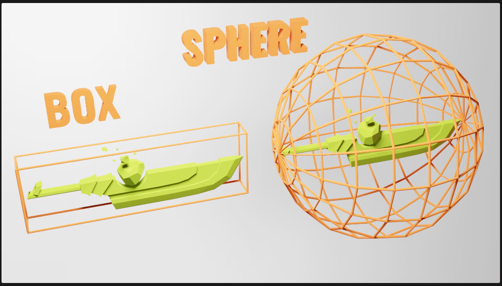

## Création d’un texte en 3D

Ce que l’on va faire, c’est recréer ce que Ilithya a fait sur son portfolio (https://www.ilithya.rocks/ ) et avoir un grand texte 3D avec des objets qui flotte autour. C’est un bon exercice qui permet de montrer ce que l’on peut faire avec peu de base en Three.js.

### 1 - Obtenir une font de format typeface

Plusieurs façon d’obtenir une font dans ce format : 

- Soit on convertit une font grâce à un converter comme celui-ci : [https://gero3.github.io/facetype.js/](http://gero3.github.io/facetype.js/)
- Soit on utilise une font fournies par Three.js que l’on retrouve dans le fichier `/node_modules/three/examples/fonts/` et les importer directement dans notre code JavaScript car il s’agit d’un fichier `.json` .

```jsx
import typefaceFont from 'three/examples/fonts/helvetiker_regular.typeface.json'
```

### 2 - Charger la font

Pour charger la font, on a besoin d’appeler la classe `FontLoader` . Ce n’est pas une classe disponible sous la variable `THREE` . On a donc besoin de l’importer directement depuis le fichier dédié

```jsx
import { FontLoader } from 'three/examples/jsm/loaders/FontLoader.js'
```

Ce loader fonctionne de la manière suivante : 2 paramètres, le premier est la font que l’on utilise, le deuxième la fonction callback.

```jsx
import typefaceFont from 'three/examples/fonts/helvetiker_regular.typeface.json'
import { FontLoader } from 'three/examples/jsm/loaders/FontLoader.js'

// Font

const fontLoader = new FontLoader()

fontLoader.load(
	typefaceFont,
	(font) => {
		console.log('loaded')
	}
)
```

Vous devriez avoir `'loaded'` dans votre console. Si ce n’est pas le cas, retournez dans les étapes précédentes pour voir ce qui ne va pas.

Nous avons maintenant accès à la variable `font` à l’intérieur de notre fonction (là où on a écrit notre console.log).

Contrairement à ce qu’on a fait précédemment, tout le code que l’on écrira se trouvera dans cette fonction.

### 3 - Création de la geometry

Nous allons utiliser la classe `TextGeometry` . Comme la `FontLoader` , nous avons besoin de l’importer

```jsx
import typefaceFont from 'three/examples/fonts/helvetiker_regular.typeface.json'
import { FontLoader } from 'three/examples/jsm/loaders/FontLoader.js'
import { TextGeometry } from 'three/examples/jsm/geometries/TextGeometry.js'
import * as THREE from 'three'

// Canvas
const canvas = document.querySelector('.webgl')

// Sizes

const sizes = {
	width : 800, 
	height: 600
}

// Camera

const camera = new THREE.PerspectiveCamera(75, sizes.width / sizes.height)
camera.position.z = 3
scene.add(camera)

// Font

const fontLoader = new FontLoader()

fontLoader.load(
	typefaceFont,
	(font) => {
		console.log('loaded')
		const textGeometry = new TextGeometry(
			'Hello World',
			{
				font: font,
				size:0.5,
				depth:0.2,
				curveSegments:12,
				bevelEnabled:true,
				bevelThickness:0.03,
				bevelSize:0.02,
				bevelOffset:0,
				bevelSegments:5
			}
		)
		const textMaterial = new THREE.MeshBasicMaterial()
		const text = new THREE.Mesh(textGeometry, textMaterial)
		scene.add(text)
	}
)
```

Décortiquons un peu le code …

Tout d’abord, on import tout ce qu’on a besoin. 

Ensuite, on instancie le `FontLoader` puis on charge notre texte. Le `textGeometry` prend 2 paramètres, le texte et un objet qui correspond aux caractéristiques de la géometrie.

On ajoute un `material` et on combine notre `geometry` et notre `material` dans une `Mesh` . 

On termine en ajoutant notre texte à la `scene` .

Si vous voulez voir quelque chose de cool, ajoutez la propriété `wireframe: true` à notre `material` .

```jsx
const textMaterial = new THREE.MeshBasicMaterial({ wireframe: true})
```

Cela nous montre comment la forme est générée et les fameux triangles que l’on a parlé au tout début du workshop.

On peut diminuer le nombre de triangle grâce aux propriétés `curveSegments`  et `bevelSegments`.

Vous pouvez supprimer le `wireframe` une fois que vous êtes satisfait du niveau de détails.

### 4 - Centrer son texte

Il existe plusieurs moyens de le faire, une façon simple et une façon compliquée. 

A titre d’information, la façon compliquée consiste à utiliser le `bounding` , en français, la délimitation. En 3D, il existe 2 types de `bounding`  : une box ou une sphère.



Par défaut, Three.js utilise un `bounding` sphérique. 

On appelle la méthode `computeBoundingBox()` sur la géométrie :

```jsx
textGeometry.computeBoundingBox()
```

Et on peut check cette box avec la propriété `boundingBox` sur la géométrie

```jsx
console.log(textGeometry.boundingBox)
```

Ce qu’on obtient, c’est un objet appelé `Box3` qui a deux propriétés : `min`  et `max` .

Si l’on test ceci, vous remarquerez que ces propriétés ne sont pas égales à 0 et cela est du à cause du `bevelThickness` et `bevelSize` .

Maintenant que nous avons les mesures, nous pouvons déplacer l'objet. Au lieu de déplacer le maillage, nous allons déplacer toute la géométrie. De cette façon, le mesh sera toujours au centre de la scène, mais la géométrie du texte sera également centrée à l'intérieur de notre mesh.

Pour ce faire, nous pouvons utiliser la méthode `translate()` sur notre géométrie juste après la méthode `computeBoundingBox()` :

```jsx
textGeometry.computeBoundingBox()

textGeometry.translate(
	- textGeometry.boundingBox.max.x * 0.5,
	- textGeometry.boundingBox.max.y * 0.5,
	- textGeometry.boundingBox.max.z * 0.5
)
```

Le texte devrait être relativement centré, mais si on veut être vraiment précis et que l’on zoom, vous remarquerez que l’on est pas totalement centré, pour l’être il faut également retirer la valeur du `bevelSize` et la valeur du `bevelThickness` .

```jsx
textGeometry.computeBoundingBox()

textGeometry.translate(
	- (textGeometry.boundingBox.max.x -0.02) * 0.5,
	- (textGeometry.boundingBox.max.y -0.02) * 0.5,
	- (textGeometry.boundingBox.max.z -0.03) * 0.5
)
```

Tout ce qu’on a fait la, il y a un moyen beaucoup plus simple de le faire. 

La façon facile consiste à utiliser la méthode `center()` sur la géométrie ! 

```jsx
textGeometry.center()
```

### 5 - Ajouter un matcap material

Il est temps pour nous d’ajouter un material à notre texte. On va utiliser la classe `MeshMatcapMaterial` car elles sont cools et ça a de bonne performance.

Tout d’abord, on va choisir une texture `matcap` . Comme pour les fonts, Three.js propose des `matcap`s de base, mais nous pouvons tout à fait ajouter les nôtres.

Les `matcap`s sont disponibles dans le dossier `/static/textures/matcaps/` .

On peut également en télécharger une dans le repo : https://github.com/nidorx/matcaps.

Pour cet exercice, on a pas besoin d’une résolution très haute et 256x256 devrait plus qu’assez.

Une fois le `matcap` choisi, nous pouvons ajouter le `textureLoader` .

```jsx
const textureLoader = ne THREE.TextureLoader()
const matcapTexture = textureLoader.load('/textures/matcaps/1.png')
```

Chose importante, c’est que les textures utilisent `map` et `matcap`  est supposé être encodé en `sRGB` et nous avons besoin d’informer Three.js en paramétrant son `colorSpace` à `THREE.SRGBColorSpace`

```jsx
const textureLoader = ne THREE.TextureLoader()
const matcapTexture = textureLoader.load('/textures/matcaps/1.png')
matcapTexture.colorSpace = THREE.SRGBColorSpace
```

On peut maintenant remplacer notre `MeshBasicMaterial` par notre `MeshMatcapMaterial` en utilisant la variable `matcapTexture`  à la propriété `matcap` .

```jsx
const textMaterial = new THREE.MeshMatcapMaterial({ matcap: matcapTexture })
```
